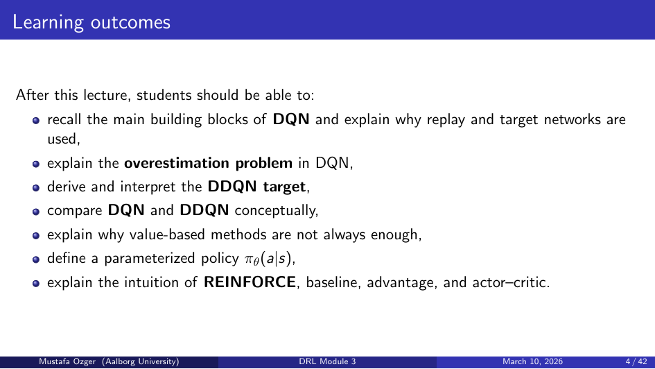
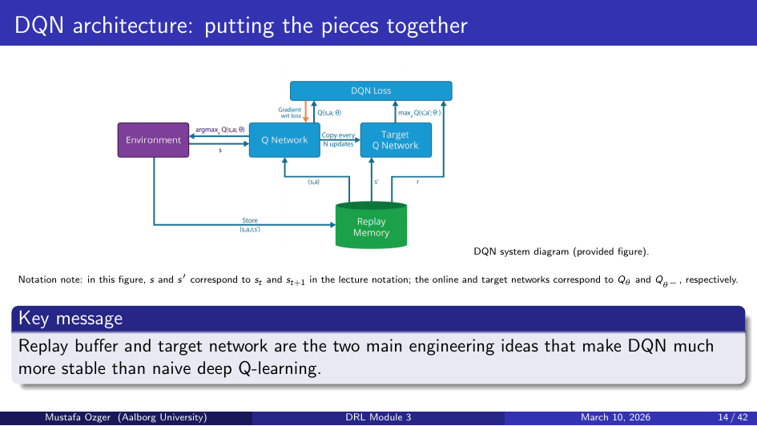
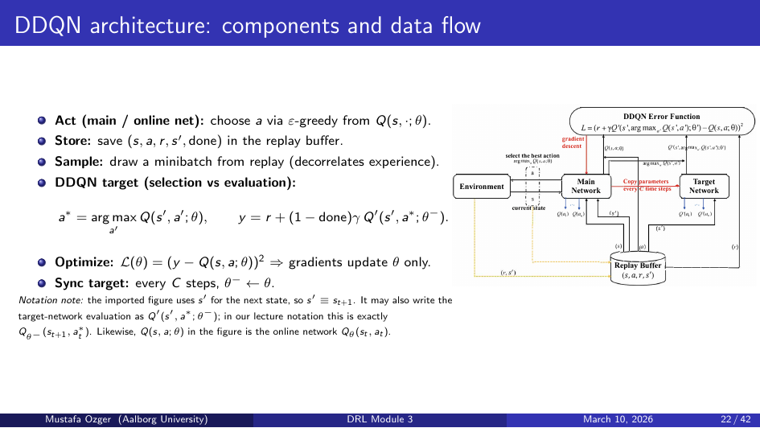
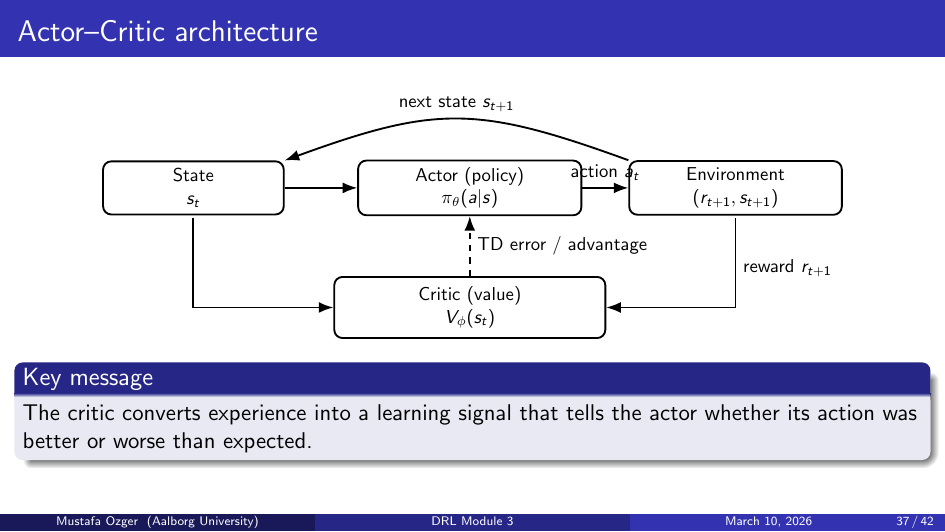

# Deep RL Module 3: DDQN and Policy Gradient Methods

## DQN Recap



- Q-network Qθ(s,a) approximates optimal action-values
- Target: yₜ = rₜ + γ max_a' Qθ⁻(sₜ₊₁, a')

## Problem: Overestimation Bias in DQN

### Why It Happens
`max_a' Qθ⁻(sₜ₊₁, a')` uses the same network to **select** and **evaluate** the best action.

Noise in Q-estimates means max always picks the overestimated action → systematic positive bias accumulates over training.

## Double DQN (DDQN)



### Fix: Decouple Selection and Evaluation
- **Selection**: use online network θ to pick best action
  ```
  a* = argmax_a Qθ(sₜ₊₁, a)
  ```
- **Evaluation**: use target network θ⁻ to evaluate that action
  ```
  yₜ = rₜ + γ Qθ⁻(sₜ₊₁, a*)
  ```

This prevents the same network from both choosing and scoring the maximum.

### Result
- Significantly reduces overestimation
- More stable value estimates
- Drop-in replacement for DQN — same architecture, just change the target formula

## Limitations of Value-Based Methods

Even with DDQN:
1. **Discrete actions only** — argmax over Q-values doesn't work for continuous action spaces
2. **Deterministic policy** — cannot represent stochastic policies (needed for certain environments)
3. **Indirect**: must extract policy from Q-values; policy not directly parameterized

## Policy Gradient Methods

### Policy Parameterization
- Directly parameterize policy: πθ(a|s)
- Goal: maximize expected return J(θ) = E_πθ[Gₜ]
- Update: θ ← θ + α ∇θ J(θ)

### Policy Gradient Theorem
```
∇θ J(θ) = E_πθ [ ∇θ log πθ(aₜ|sₜ) · Gₜ ]
```
- `∇θ log πθ(a|s)`: direction to increase probability of action a
- Weighted by return Gₜ: reinforce good actions, suppress bad ones

### REINFORCE Algorithm
```
for each episode:
    collect trajectory (s₀,a₀,r₀,...,sT)
    for each t:
        Gₜ = Σₖ γᵏ rₜ₊ₖ
        θ ← θ + α ∇θ log πθ(aₜ|sₜ) Gₜ
```
- Simple but **high variance** (full episode returns are noisy)
- **Unbiased** estimate of policy gradient

### Variance Reduction: Baseline
Subtract a baseline b(s) from the return:
```
∇θ J(θ) = E [ ∇θ log πθ(a|s) · (Gₜ − b(sₜ)) ]
```
- Doesn't change the expected gradient (baseline cancels out)
- Reduces variance: actions better than average get positive signal, worse get negative
- Natural choice: b(sₜ) = Vπ(sₜ) → yields **advantage function** Aₜ = Gₜ − V(sₜ)

### Advantage Function
```
Aₜ = Qπ(sₜ,aₜ) − Vπ(sₜ)
```
- Measures how much better action aₜ is than the average action in state sₜ
- Positive advantage → increase π(a|s); negative → decrease

## Actor-Critic Bridge


- **Actor**: policy network πθ(a|s) — updated via policy gradient
- **Critic**: value network Vφ(s) — provides the baseline / advantage estimate
- Actor uses critic's estimate to compute advantage; critic learns from TD error
- Enables online (step-by-step) updates rather than waiting for full episodes

## Value-Based vs Policy Gradient Comparison

| | Value-Based (DQN/DDQN) | Policy Gradient (PG) |
|--|------------------------|----------------------|
| Action space | Discrete | Discrete or continuous |
| Policy type | Implicit (argmax Q) | Explicit πθ(a|s) |
| Stochastic policy | No | Yes |
| Sample efficiency | Higher (replay) | Lower (on-policy) |
| Stability | Higher | Lower (high variance) |

## Key Takeaways
- DDQN fixes overestimation by decoupling action selection from evaluation
- Policy gradients directly optimize πθ; enable continuous/stochastic policies
- REINFORCE is unbiased but high variance; baseline subtracts Vπ to reduce variance
- Advantage function = how much better than average → actor-critic combines best of both worlds
