# Module I: Introduction to AI and Machine Learning

## AI / ML / DL Taxonomy

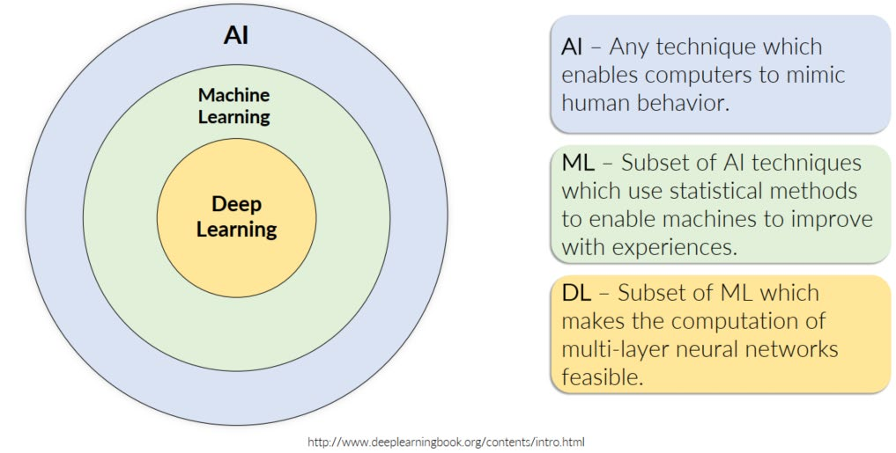

- **Artificial Intelligence (AI)**: broad field — systems that exhibit intelligent behavior
- **Machine Learning (ML)**: subset of AI — systems that learn from data rather than explicit rules
- **Deep Learning (DL)**: subset of ML — multi-layer neural networks that learn hierarchical representations

## Types of Machine Learning

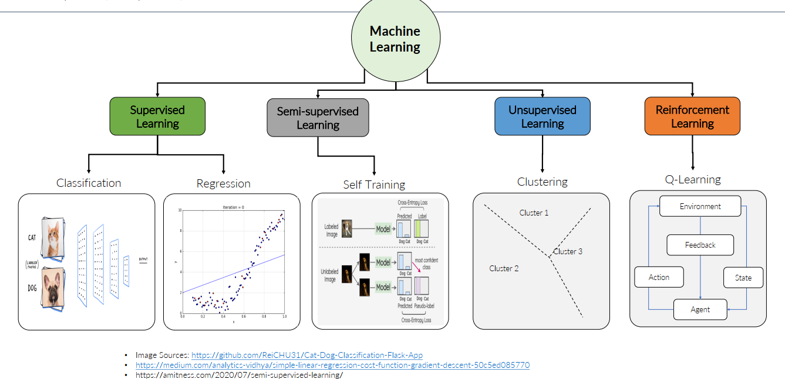
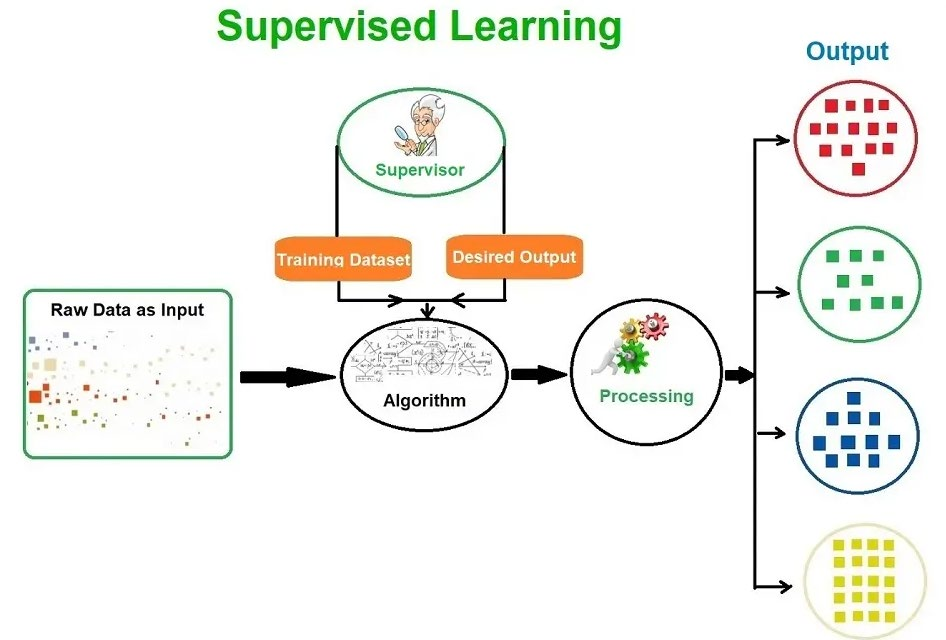
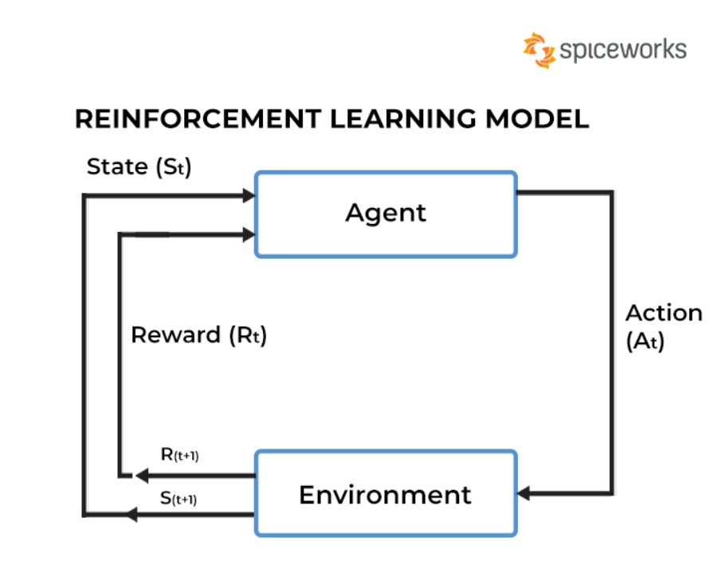

| Type | Description | Examples |
|------|-------------|---------|
| **Supervised** | Labeled input-output pairs; learn a mapping f(X)→Y | Classification, regression |
| **Unsupervised** | No labels; find hidden structure in X | Clustering, dimensionality reduction |
| **Semi-supervised** | Mix of labeled and unlabeled data | Self-training, label propagation |
| **Reinforcement Learning** | Agent learns via rewards from environment interactions | Game playing, robotics |

## Data Preprocessing Pipeline

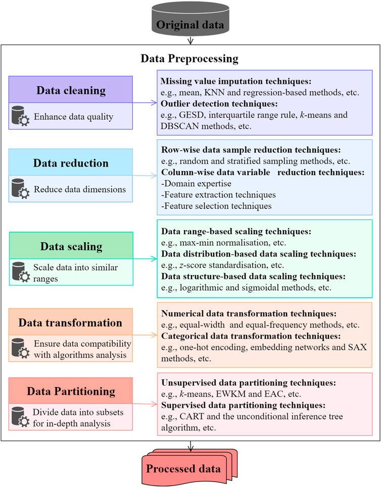

### 1. Data Cleaning
- Handle missing values (imputation, removal)
- Remove duplicates, fix inconsistencies
- Detect and treat outliers

### 2. Data Transformation

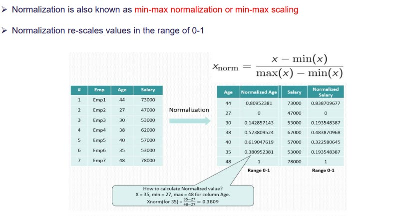
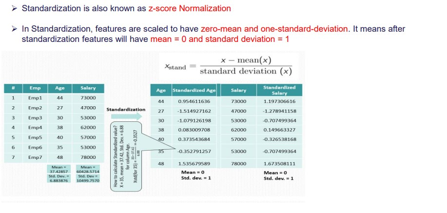
- **Normalization** (min-max): scale to [0, 1]
- **Standardization** (z-score): zero mean, unit variance — preferred when distribution is approximately Gaussian
- **Encoding**: one-hot for nominal categories, ordinal encoding for ordered categories

### 3. Feature Selection vs Feature Extraction

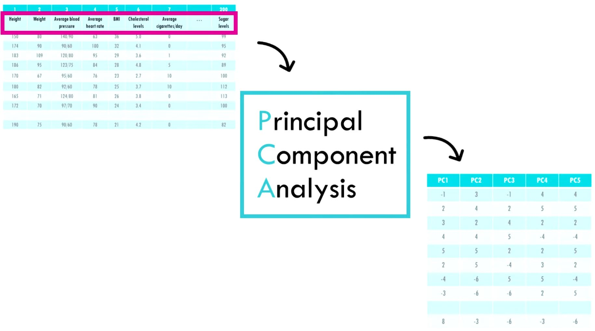
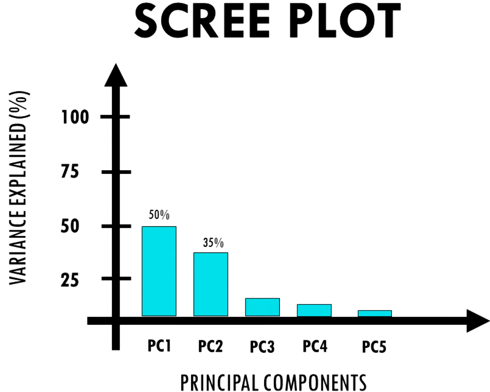
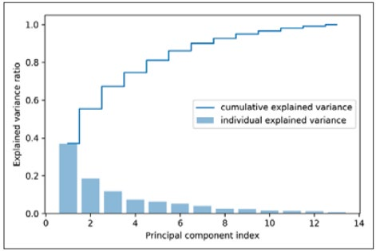
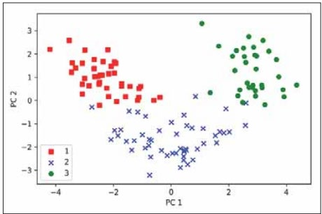
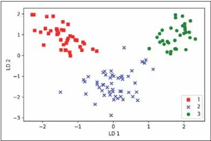

**Feature Selection** — pick a subset of original features:
- Filter methods (correlation, mutual information)
- Wrapper methods (recursive feature elimination)
- Embedded methods (L1 regularization)

**Feature Extraction** — create new features from originals:

#### PCA (Principal Component Analysis)
- Unsupervised, linear
- Finds orthogonal directions of maximum variance (principal components)
- Steps: center data → compute covariance matrix → eigendecomposition → keep top-k eigenvectors
- Reduces dimensionality while preserving most variance
- No class labels used → purely structural

#### LDA (Linear Discriminant Analysis)
- Supervised, linear
- Maximizes between-class scatter / within-class scatter ratio
- Finds directions that best separate classes
- At most C-1 discriminant components for C classes

### 4. Data Partitioning

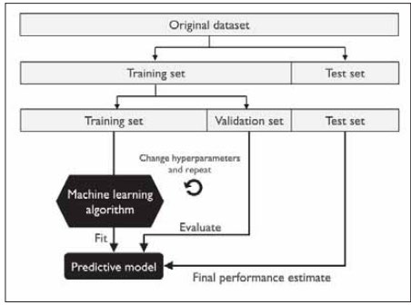
- **Train / Validation / Test** split (e.g., 60/20/20)
- **k-Fold Cross-Validation**: rotate k folds for more robust evaluation
- Stratified splits preserve class balance

## Key Distinctions

| | PCA | LDA |
|--|-----|-----|
| Supervised? | No | Yes |
| Goal | Max variance | Max class separation |
| Components | min(n, d) | C−1 |

## Common Pitfalls
- Data leakage: preprocessing on full dataset before splitting
- Class imbalance: oversample minority / undersample majority / use class weights
- Feature scaling required for distance-based and gradient-based models
