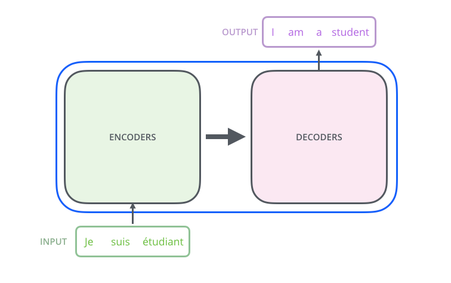
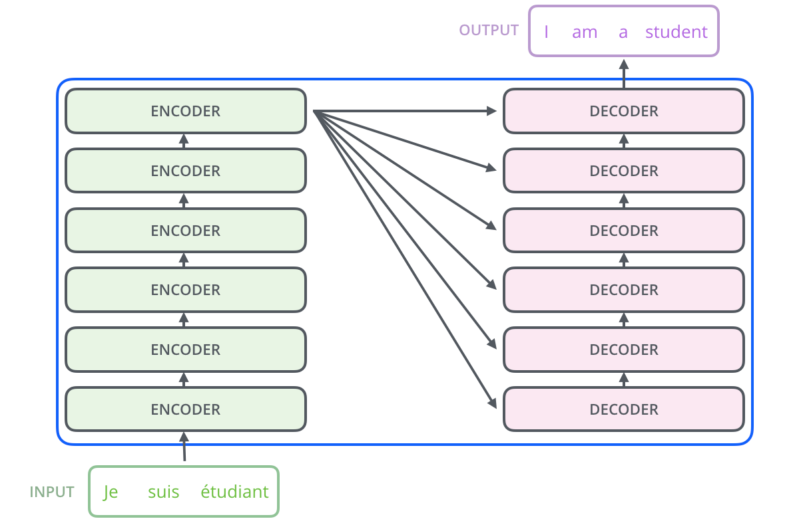
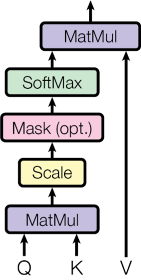
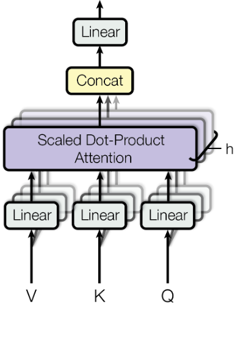
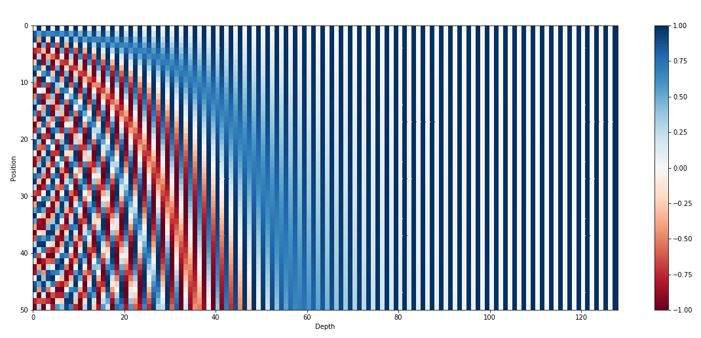
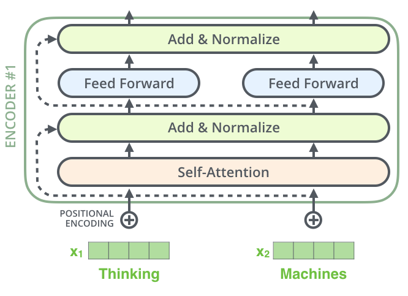
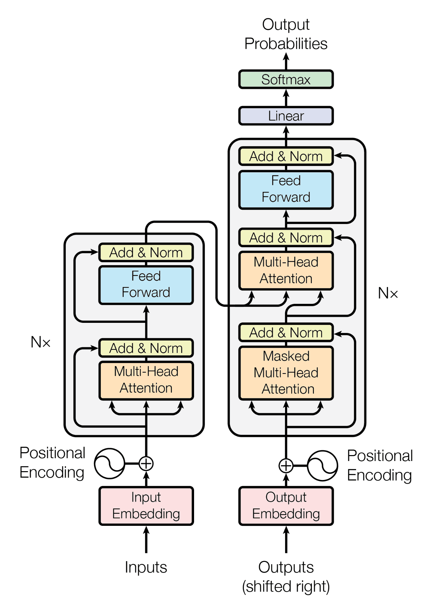
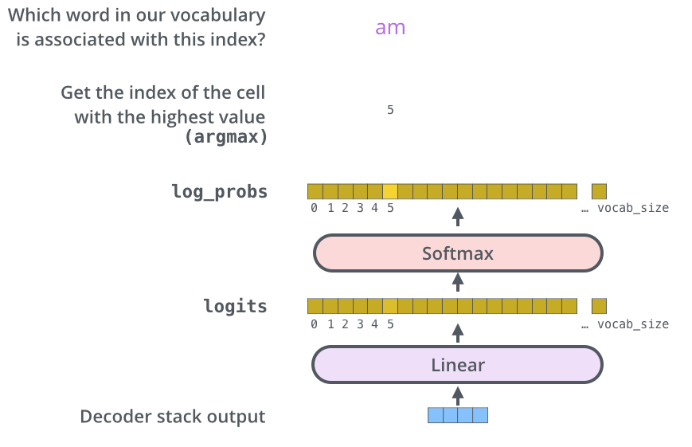
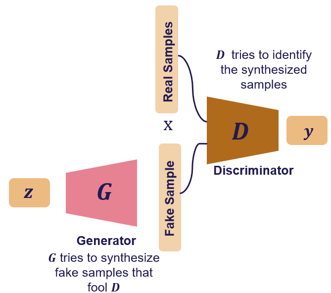

# Module IX: Generative Modeling II — Attention, Transformers, and GANs

## Sequence Modeling and Attention

### Limitation of RNN/LSTM for Long Sequences


- Hidden state hₜ must compress entire history into fixed vector
- Information bottleneck for very long sequences
- Sequential computation prevents parallelization during training

### Attention Mechanism (Bahdanau 2015)


- Encoder produces a sequence of hidden states (h₁,...,hT)
- Decoder at step t computes a **context vector** cₜ as a weighted sum:
  ```
  cₜ = Σⱼ αₜⱼ hⱼ
  αₜⱼ = softmax(eₜⱼ),    eₜⱼ = score(sₜ₋₁, hⱼ)
  ```
- Attention weights αₜⱼ: how much to attend to encoder position j at decoder step t
- Score function: learned alignment model (e.g., additive: vᵀ tanh(Wₛ sₜ + Wₕ hⱼ))
- Allows decoder to focus on relevant parts of input; no information bottleneck

---

## Transformer ("Attention Is All You Need" — Vaswani et al. 2017)

### Key Idea
Replace recurrence entirely with **self-attention**. All tokens attend to all other tokens simultaneously → fully parallelizable.

### Scaled Dot-Product Attention


Inputs: Queries Q, Keys K, Values V (all matrices)
```
Attention(Q, K, V) = softmax( QKᵀ / √dₖ ) · V
```
- QKᵀ: similarity scores between all query-key pairs
- √dₖ scaling: prevents dot products from growing too large, keeping softmax gradients well-behaved
- Output: weighted sum of values; weights determined by query-key similarity

### Multi-Head Attention


```
MultiHead(Q,K,V) = Concat(head₁,...,headₕ) Wₒ
headᵢ = Attention(Q Wᵢᴼ, K Wᵢᴷ, V Wᵢᵛ)
```
- h parallel attention heads, each with own learned projection
- Different heads can capture different types of relationships (syntax, coreference, etc.)
- Outputs concatenated and projected

### Positional Encoding


Self-attention is permutation-invariant — add positional encoding to inject order:
```
PE(pos, 2i)   = sin(pos / 10000^(2i/d_model))
PE(pos, 2i+1) = cos(pos / 10000^(2i/d_model))
```
- Added to token embeddings; unique signature for each position
- Sinusoidal: handles unseen sequence lengths via interpolation

### Transformer Encoder Block (repeated N times)


```
x → MultiHead Self-Attention → Add & Norm → Feed-Forward → Add & Norm → output
```
- **Residual connections** (Add): prevent vanishing gradients, preserve information flow
- **Layer normalization** (Norm): stabilizes activations
- **Position-wise FFN**: two linear layers with ReLU, applied independently to each position

### Transformer Decoder Block
- **Masked self-attention**: attention only to previous positions (causal/autoregressive)
- **Cross-attention**: queries from decoder, keys/values from encoder output
- Feed-forward + residuals

### Full Architecture



```
Encoder: N × [Multi-Head Self-Attention + FFN + residuals]
Decoder: N × [Masked Self-Attention + Cross-Attention + FFN + residuals]
```

### Why Transformers Dominate
- Parallelizable training (vs sequential RNN)
- Direct long-range dependencies (no path length bottleneck)
- Scalable: more data + more parameters → better performance
- Foundation for BERT, GPT, T5, ViT, and beyond

---

## Generative Adversarial Networks (GANs)

### Core Idea (Goodfellow et al. 2014)


Two networks compete:
- **Generator G(z)**: maps noise z ~ P(z) to fake data x̂ = G(z)
- **Discriminator D(x)**: outputs probability that x is real (not generated)

Training is a **minimax game**:
```
min_G max_D E_x[log D(x)] + E_z[log(1 − D(G(z)))]
```
- D maximizes: correctly distinguish real vs fake
- G minimizes: fool D into classifying G(z) as real

### Training Dynamics
In practice, alternate:
1. **Train D**: freeze G, maximize log D(real) + log(1-D(fake))
2. **Train G**: freeze D, maximize log D(G(z))  ← use this form instead of minimizing log(1-D(G(z))) to avoid vanishing gradients early in training

### Nash Equilibrium
Theoretical optimum: G reproduces the real data distribution → D(x) = 0.5 everywhere.

### Common GAN Variants

| Variant | Key Innovation |
|---------|---------------|
| **DCGAN** | Convolutional G and D; batch norm; leaky ReLU in D |
| **Conditional GAN (cGAN)** | Class label y as additional input to G and D; control generation |
| **Pix2Pix** | Image-to-image translation with paired training data; L1 + adversarial loss |
| **CycleGAN** | Unpaired image translation; cycle-consistency loss |
| **StyleGAN** | Disentangled style control; progressive growing; high-quality faces |
| **WGAN** | Wasserstein distance instead of JS divergence; fixes training stability |

### GAN Training Challenges
- **Mode collapse**: G produces limited variety; always fools D with same outputs
- **Non-convergence**: G and D oscillate rather than converge
- **Discriminator too strong**: no gradient signal reaches G
- Fixes: feature matching, mini-batch discrimination, spectral normalization, WGAN

### GAN Applications
- Photorealistic image synthesis
- Style transfer, image editing
- Data augmentation
- Text-to-image (with conditioning)
- Video generation, super-resolution

---

## Attention vs Self-Attention Summary

| | RNN + Attention | Transformer Self-Attention |
|--|----------------|--------------------------|
| Computation | Sequential | Parallel |
| Long-range deps | Limited by hidden state | O(1) path length |
| Memory | O(n) hidden states | O(n²) attention matrix |
| Scalability | Poor | Excellent |

## Key Takeaways
- Bahdanau attention lets decoder selectively focus on encoder states; breaks bottleneck
- Transformer: scaled dot-product attention + positional encoding + residuals = state of the art
- Multi-head attention captures diverse relationships simultaneously
- GANs: adversarial game between generator and discriminator; Nash equilibrium = perfect generation
- GAN training is unstable; WGAN, spectral normalization, and careful hypertuning help
