# Module II: Deep Learning — MLPs and CNNs

## From Perceptron to MLP

### Perceptron

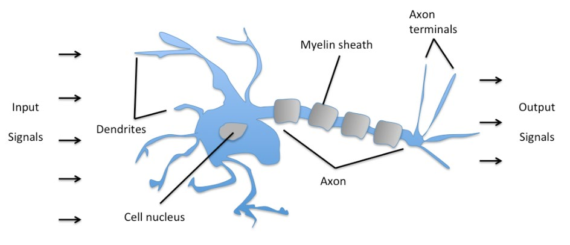
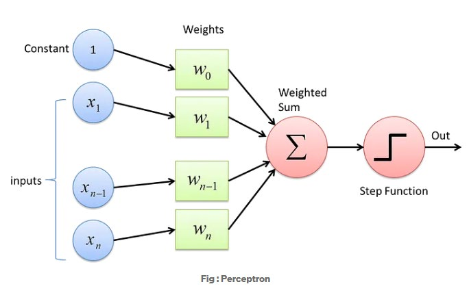
- Binary classifier: output = sign(w·x + b)
- Only linearly separable problems; no hidden layers

### Adaline (Adaptive Linear Neuron)

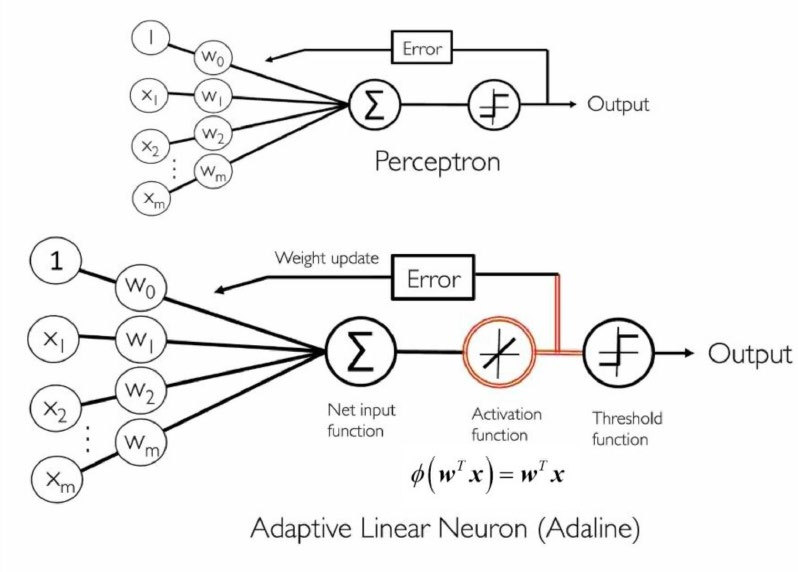
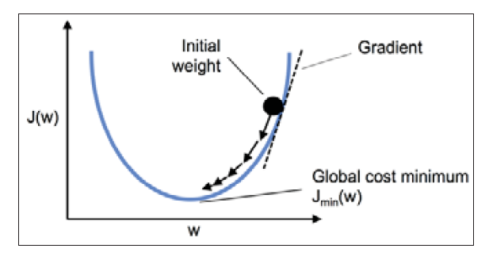
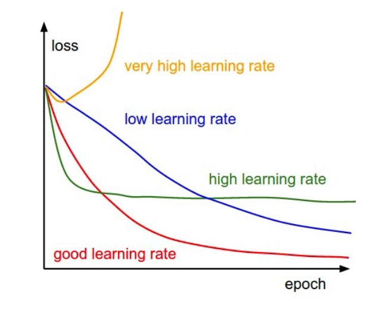
- Linear activation during training, threshold at test
- Minimizes MSE loss with gradient descent
- Precursor to logistic regression

### Logistic Regression
- Sigmoid activation: σ(z) = 1/(1+e^−z)
- Outputs probability; trained with binary cross-entropy loss
- Still linear decision boundary

## Multi-Layer Perceptron (MLP)

### Architecture

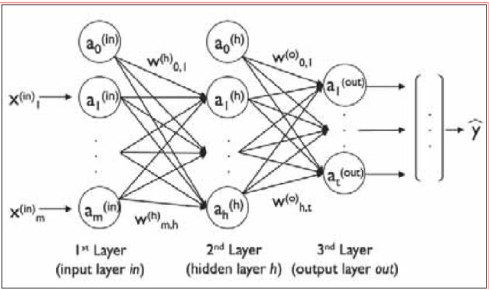
- Input layer → hidden layer(s) → output layer
- Each neuron: z = w·x + b, a = activation(z)
- Universal approximator with at least one hidden layer

### Forward Propagation
1. Compute z^(l) = W^(l) a^(l-1) + b^(l) for each layer
2. Apply activation: a^(l) = f(z^(l))
3. Compute loss at output layer

### Backpropagation
- Chain rule: δ^(l) = (W^(l+1)T δ^(l+1)) ⊙ f'(z^(l))
- Gradients: ∂L/∂W^(l) = δ^(l) (a^(l-1))T
- Update: W ← W − η ∇W L

### Activation Functions

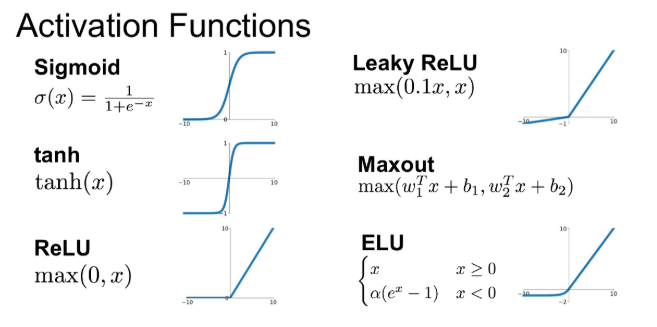
| Function | Formula | Use |
|----------|---------|-----|
| Sigmoid | 1/(1+e^−z) | Binary output |
| Tanh | (e^z−e^−z)/(e^z+e^−z) | Hidden layers (zero-centered) |
| ReLU | max(0, z) | Default hidden layer choice |
| Leaky ReLU | max(αz, z) | Avoid dying ReLU |
| Softmax | e^zi / Σ e^zj | Multi-class output |

### Loss Functions
- **MSE**: regression tasks
- **Binary cross-entropy**: binary classification
- **Categorical cross-entropy**: multi-class classification

## Convolutional Neural Networks (CNNs)

### Motivation
- MLPs on images: too many parameters, lose spatial structure
- CNNs exploit local connectivity and translation equivariance

### Key Operations

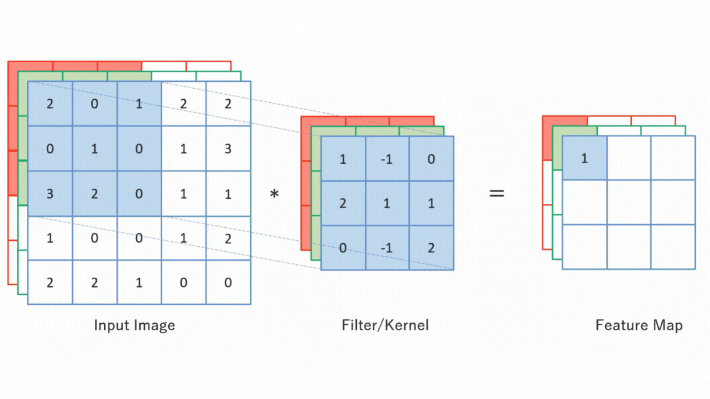
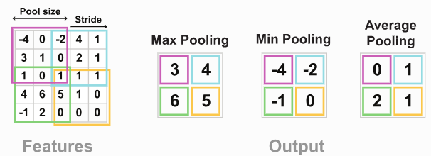

#### Convolution
- Filter (kernel) slides over input with stride s, producing feature map
- Parameters: filter size k×k, num filters F, padding p, stride s
- Output size: ⌊(W − k + 2p)/s⌋ + 1
- Same filters detect same feature anywhere in image (parameter sharing)

#### Pooling
- **Max pooling**: take maximum in each window (most common)
- **Average pooling**: take mean
- Reduces spatial size, provides translation invariance, reduces parameters

#### Typical CNN Block
Conv → BatchNorm → ReLU → Pooling

### CNN Architecture Pattern

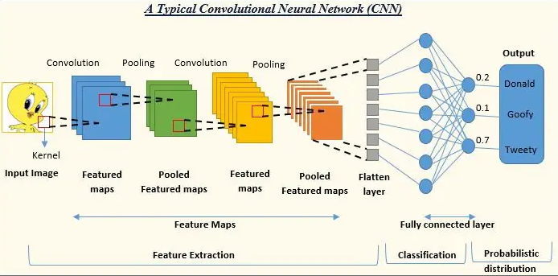
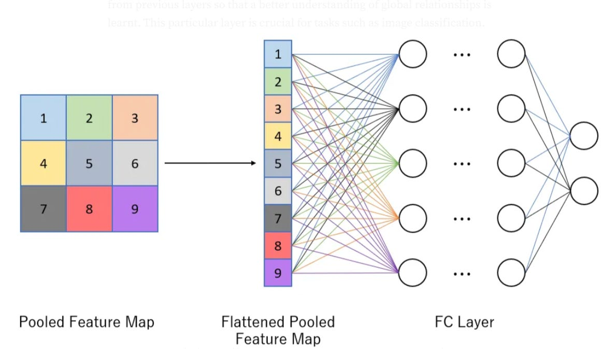
```
[Conv + ReLU + Pool] × N  →  Flatten  →  FC layers  →  Softmax
```
- Early layers: edges, textures
- Deeper layers: shapes, objects, abstract features

### Overfitting and Regularization

| Technique | Mechanism |
|-----------|-----------|
| **L1/L2 regularization** | Penalize large weights in loss |
| **Dropout** | Randomly zero activations during training |
| **Batch Normalization** | Normalize layer inputs; also regularizes slightly |
| **Data augmentation** | Flip, crop, rotate, color jitter training images |
| **Early stopping** | Stop when validation loss stops improving |

## TensorFlow / Keras Essentials
- `model = Sequential([Dense(64, activation='relu'), Dense(10, activation='softmax')])`
- Compile: `model.compile(optimizer='adam', loss='categorical_crossentropy', metrics=['accuracy'])`
- Train: `model.fit(X_train, y_train, validation_data=..., epochs=..., batch_size=...)`
- Callbacks: `EarlyStopping`, `ModelCheckpoint`, `ReduceLROnPlateau`

## Key Concepts Summary
- MLPs learn any function but scale poorly to images
- CNNs use convolution for local feature detection + parameter sharing
- Batch normalization stabilizes training, allows higher learning rates
- Dropout is a powerful regularizer for preventing co-adaptation
