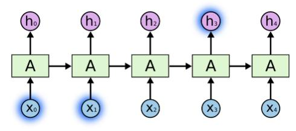
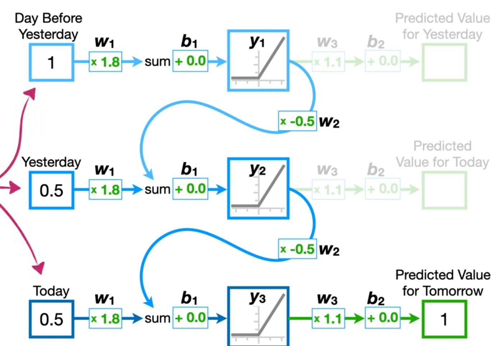
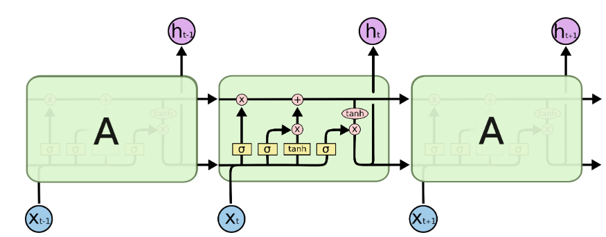
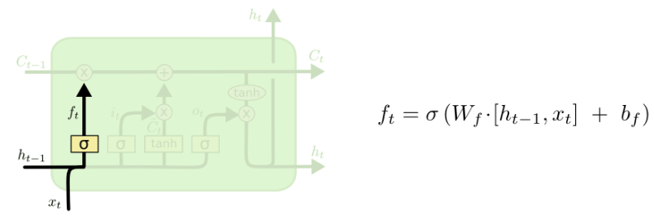
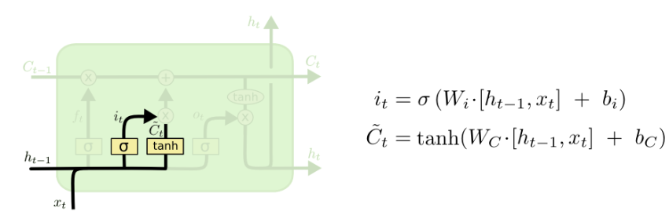
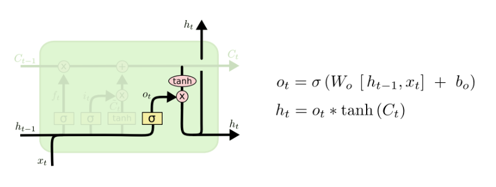
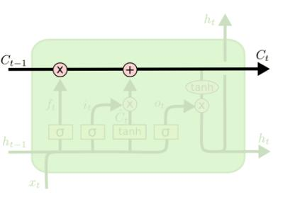
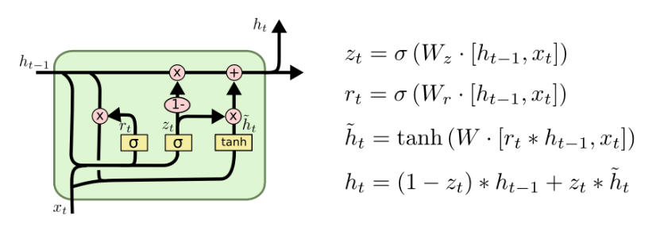

# Module VIII: Recurrent Neural Networks and LSTM

## Sequential Data Problems

MLPs and CNNs treat inputs as fixed-size independent vectors. Sequential data (text, speech, time series) has:
- Variable-length inputs/outputs
- Temporal dependencies — earlier tokens affect later ones
- Order matters

## Recurrent Neural Networks (RNNs)

### Architecture



- Hidden state hₜ carries memory across time steps
- hₜ = tanh(Wₓ xₜ + Wₕ hₜ₋₁ + b)
- Output: yₜ = Wᵧ hₜ + bᵧ
- Same weights (Wₓ, Wₕ, Wᵧ) reused at each step → parameter sharing over time

### RNN Variants by Input/Output Shape
| Type | Description | Example |
|------|-------------|---------|
| One-to-one | Standard feedforward | Image classification |
| One-to-many | Single input, sequence output | Image captioning |
| Many-to-one | Sequence input, single output | Sentiment analysis |
| Many-to-many (sync) | Sequence in, sequence out (same length) | POS tagging |
| Many-to-many (async) | Encoder-decoder | Machine translation |

### Backpropagation Through Time (BPTT)
- Unroll RNN for T steps, apply backprop on unrolled graph
- Gradient flows through hₜ → hₜ₋₁ → ... → h₁
- **Vanishing gradients**: gradients shrink exponentially for long sequences → network forgets distant past
- **Exploding gradients**: gradients grow unboundedly → clip gradients as fix

## Word Embeddings
- Map discrete tokens to dense real-valued vectors
- **Word2Vec** (Skip-gram / CBOW): predict context from word or word from context
- Embeddings encode semantic similarity (king − man + woman ≈ queen)
- Pre-trained embeddings (GloVe, fastText) transfer knowledge to downstream tasks

## Long Short-Term Memory (LSTM)

### Motivation
Designed to address vanishing gradients — explicitly maintain a **cell state** Cₜ that can carry information across many steps with minimal modification.

### Gates





| Gate | Formula | Purpose |
|------|---------|---------|
| **Forget** fₜ | σ(Wf [hₜ₋₁, xₜ] + bf) | What to erase from cell state |
| **Input** iₜ | σ(Wi [hₜ₋₁, xₜ] + bi) | What new info to write |
| **Cell candidate** C̃ₜ | tanh(Wc [hₜ₋₁, xₜ] + bc) | New candidate values |
| **Output** oₜ | σ(Wo [hₜ₋₁, xₜ] + bo) | What to expose as hidden state |

### Cell State Update


```
Cₜ = fₜ ⊙ Cₜ₋₁  +  iₜ ⊙ C̃ₜ
hₜ = oₜ ⊙ tanh(Cₜ)
```
- The **additive** update to Cₜ keeps gradients from vanishing

## Gated Recurrent Unit (GRU)



Simplified LSTM with two gates instead of three:
- **Reset gate** rₜ = σ(Wr [hₜ₋₁, xₜ])  — how much past to forget
- **Update gate** zₜ = σ(Wz [hₜ₋₁, xₜ])  — interpolate old and new state
- h̃ₜ = tanh(W [rₜ ⊙ hₜ₋₁, xₜ])
- hₜ = (1 − zₜ) ⊙ hₜ₋₁  +  zₜ ⊙ h̃ₜ

GRU has fewer parameters than LSTM; often comparable performance.

## Practical Extensions

### Bidirectional RNNs
- Run two RNNs: one forward, one backward through sequence
- Concatenate hidden states: hₜ = [h→ₜ ; h←ₜ]
- Useful when full context is available (e.g., NLP, not real-time streaming)

### Stacked (Deep) RNNs
- Multiple RNN layers stacked; each layer's output is the next layer's input
- Captures higher-level abstractions

### Dropout for RNNs
- Apply dropout only on non-recurrent connections (Dropout on input/output, not hₜ → hₜ₊₁)
- Or use **variational dropout** (same mask at every time step)

## Applications
- Language modeling (next-word prediction)
- Machine translation (seq2seq with attention)
- Speech recognition, synthesis
- Time series forecasting
- Video captioning

## Key Takeaways
- Vanilla RNN: simple but suffers from vanishing gradients
- LSTM: gates + cell state solve vanishing gradient problem
- GRU: lighter alternative to LSTM
- Bidirectional for offline tasks; unidirectional for online/streaming
