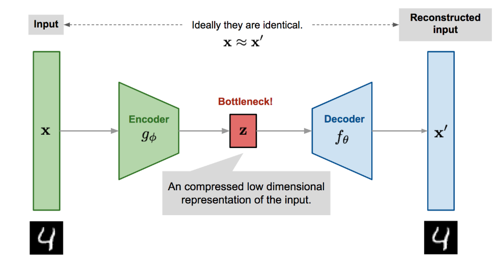
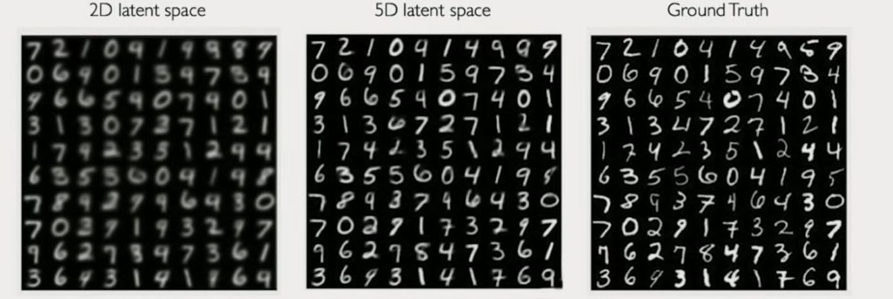
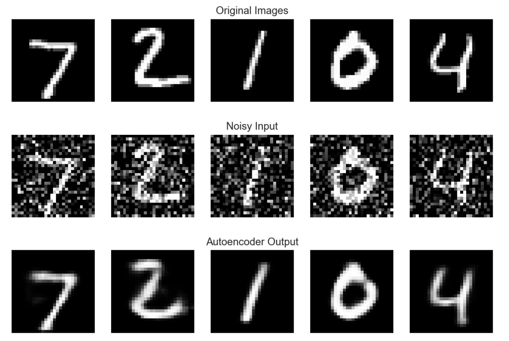
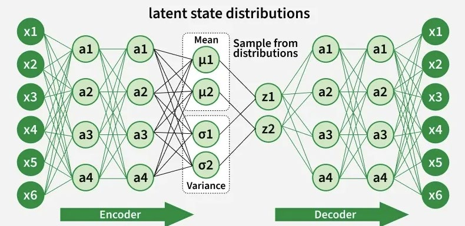
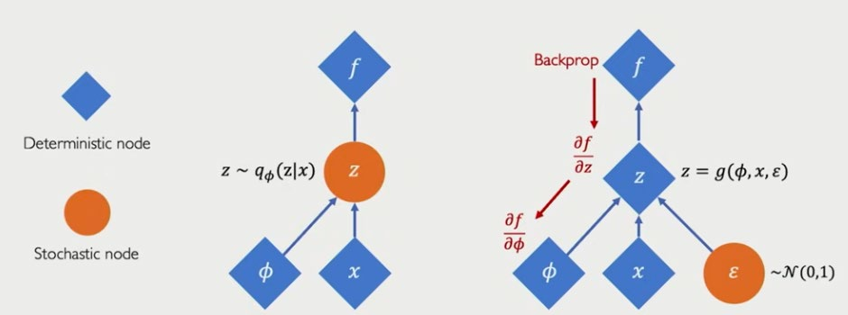
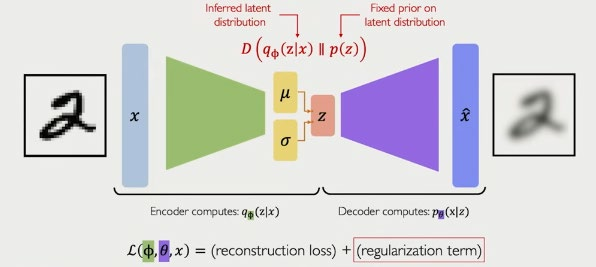
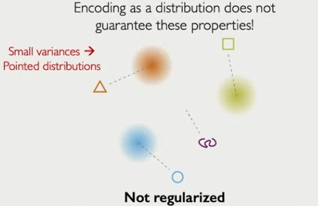
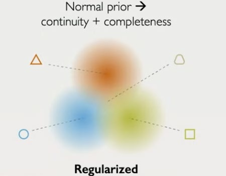

# Module IX: Foundations of Generative Modeling I — Autoencoders and VAEs

## Discriminative vs Generative Models

| | Discriminative | Generative |
|--|---------------|-----------|
| Models | P(y|x) | P(x) or P(x,y) |
| Goal | Classification/regression | Understand data distribution; sample new data |
| Examples | CNN classifier, logistic regression | VAE, GAN, GPT |

## Generative AI Overview
- **GenAI**: models that learn to generate new data indistinguishable from training data
- Applications: image synthesis, text generation, drug discovery, music composition
- Key challenge: learn a compact, meaningful latent representation of the data distribution

---

## Autoencoder (AE)

### Architecture


```
Input x  →  Encoder fθ  →  Latent z  →  Decoder gφ  →  Reconstruction x̂
```
- **Encoder**: compresses x to low-dimensional z (bottleneck)
- **Decoder**: reconstructs x from z
- Loss: **Reconstruction loss** L = ||x − x̂||²  (MSE) or binary cross-entropy

### What the Bottleneck Forces


- Encoder must discard noise and keep only essential information
- Decoder must reconstruct from compressed representation
- Latent space z captures the manifold structure of the data

### Limitations
- Deterministic mapping x → z → x̂
- Latent space is not structured → cannot sample meaningful new points
- No continuity guarantee in z space

---

## Stacked Autoencoders

Two training strategies:
1. **Greedy layer-wise (incremental)**: train one AE layer at a time, freeze previous layers
   - Easier optimization in deep networks (historically motivated pre-backprop)
2. **End-to-end**: train all layers jointly
   - Standard practice now with modern optimizers and activations

---

## Regularized Autoencoders

### Denoising Autoencoder


- **Input corruption**: add noise to x → x̃ = x + ε or mask features
- Train to reconstruct clean x from noisy x̃
- Forces encoder to learn robust, noise-invariant features
- Objective: L = ||x − gφ(fθ(x̃))||²

### Sparse Autoencoder
- Add sparsity penalty to latent activations: L = ||x − x̂||² + λ ||z||₁
- Encourages few active neurons at a time
- Relates to sparse coding in neuroscience

### Contractive Autoencoder
- Penalize sensitivity of encoder output to input perturbations:
  L = ||x − x̂||² + λ ||Jfθ(x)||²F
- Jfθ: Jacobian of encoder w.r.t. x
- Forces smooth latent space; features are stable to small input changes

---

## Variational Autoencoder (VAE)



### Motivation
Make the latent space a proper probability distribution → enable sampling of new, meaningful data points.

### Generative Model
- Assume latent z ~ N(0, I)
- Data generated: x ~ P(x|z) = gφ(z)

### Inference Network (Encoder)
- Approximate posterior: qθ(z|x) ≈ P(z|x)
- Encoder outputs **mean** μ(x) and **log-variance** log σ²(x) of a Gaussian
- z ~ N(μ(x), σ²(x))

### Reparameterization Trick


Standard sampling z ~ N(μ, σ²) is non-differentiable. Rewrite as:
```
z = μ(x) + σ(x) ⊙ ε,    ε ~ N(0, I)
```
- Gradient flows through μ and σ; ε is a fixed noise sample
- Enables backpropagation through the sampling operation

### VAE Loss (ELBO)


```
L = E_qθ[log P(x|z)] − KL(qθ(z|x) || P(z))
```
- **Reconstruction term**: log P(x|z) — how well decoder reconstructs x (maximized)
- **KL term**: KL divergence between approximate posterior and prior N(0,I) — regularizes latent space (minimized)

KL for Gaussians has closed form:
```
KL = -½ Σ (1 + log σᵢ² − μᵢ² − σᵢ²)
```

### VAE Properties



- **Continuity**: nearby z produces similar outputs (smooth interpolation)
- **Completeness**: every z sampled from prior generates a plausible output
- Latent space is organized and explorable

### β-VAE
```
L = E[log P(x|z)] − β · KL(q(z|x) || P(z))
```
- β > 1: stronger regularization → more disentangled latent factors
- β = 1: standard VAE
- Trade-off: disentanglement vs reconstruction quality

---

## Autoencoder Family Summary

| Model | Input | Loss Extra | Key Property |
|-------|-------|------------|-------------|
| Basic AE | Clean | None | Compression |
| Denoising AE | Noisy | None | Robust features |
| Sparse AE | Clean | L1(z) | Sparse codes |
| Contractive AE | Clean | ||Jf||² | Smooth manifold |
| VAE | Clean | KL term | Generative, structured latent |
| β-VAE | Clean | β·KL | Disentangled latent |

## Key Takeaways
- Autoencoders learn compressed representations via reconstruction
- Denoising/sparse/contractive AEs add inductive bias to latent structure
- VAE introduces probabilistic latent space; reparameterization trick enables backprop
- KL term in ELBO regularizes z toward N(0,I), enabling sampling
- β-VAE trades reconstruction quality for disentanglement
