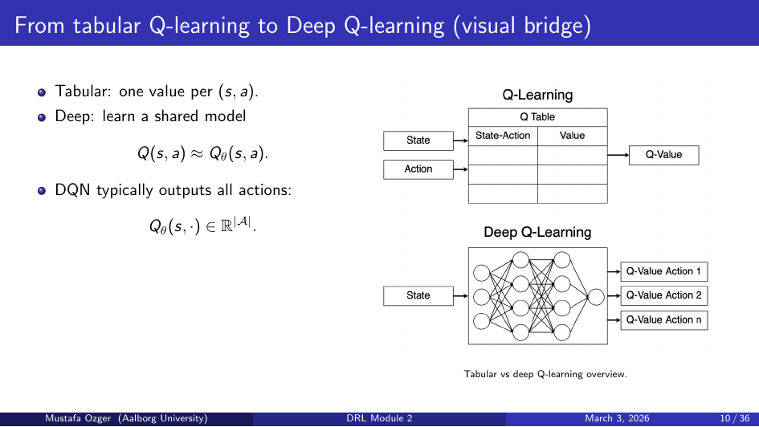
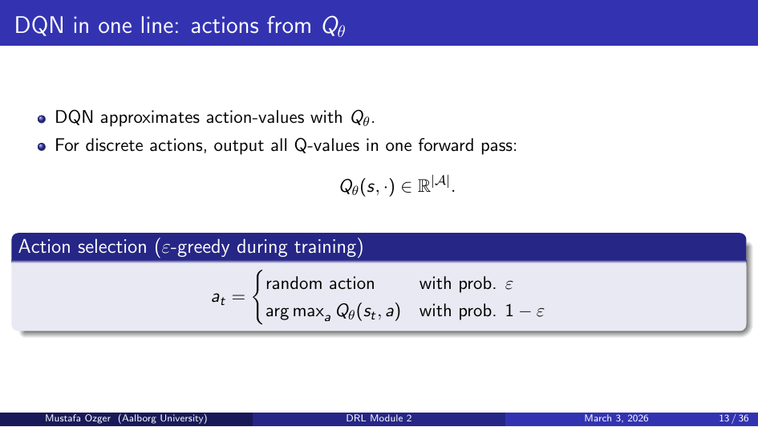
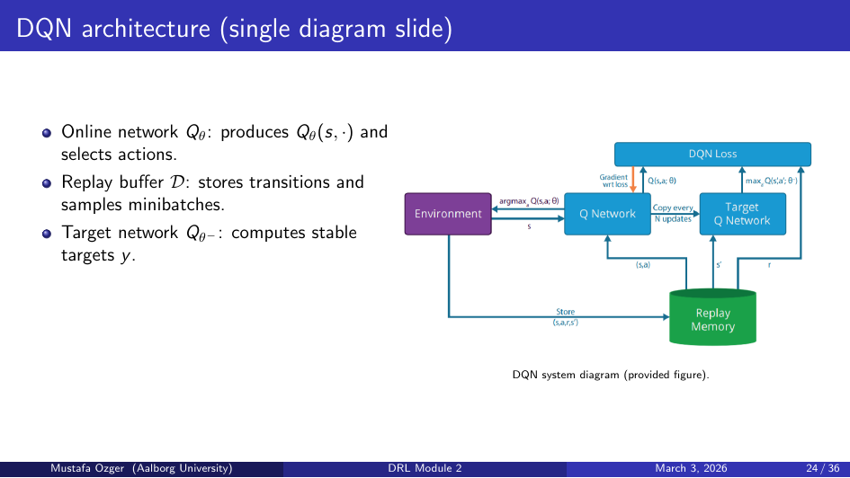
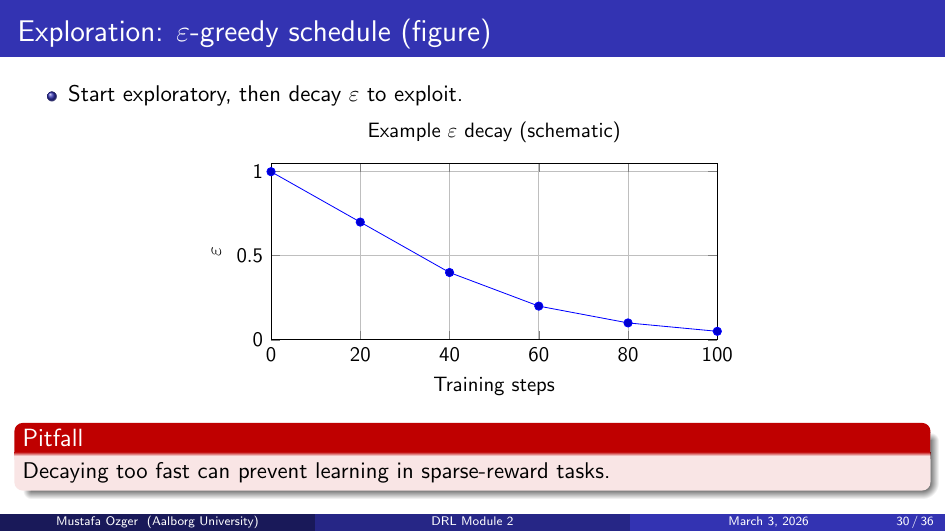
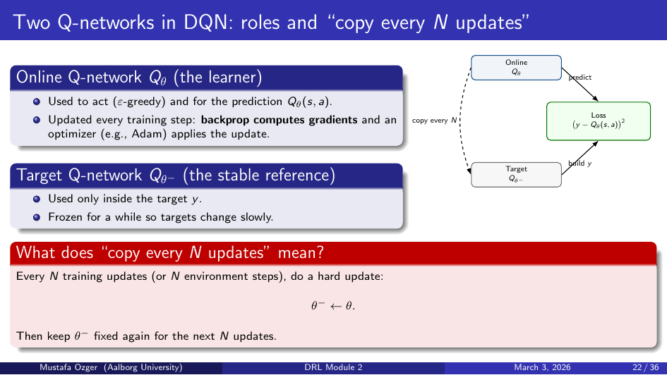
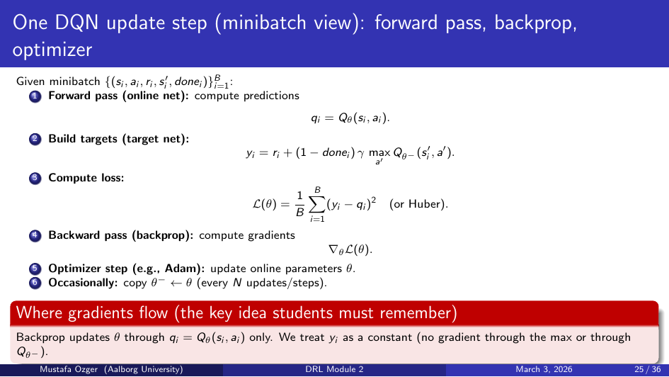
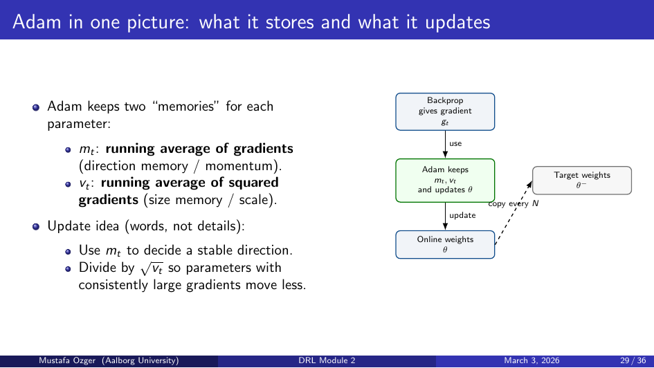

# Deep RL Module 2: Deep Q-Networks (DQN)

## From Q-Learning to DQN



Tabular Q-learning fails for large/continuous state spaces. DQN replaces the Q-table with a neural network Qθ(s,a).

### Core Problems Solved by DQN
1. **Correlated samples** — consecutive transitions are highly correlated → **Experience Replay**
2. **Moving target** — Q-target depends on current θ, causing instability → **Target Network**

## DQN Architecture



- Input: state s (e.g., stack of 4 game frames, preprocessed to grayscale 84×84)
- Output: Q-value for each action (one head per action)
- Typically: Conv layers → Flatten → FC layers → Q-values

## ε-Greedy Exploration


```
aₜ = argmax_a Qθ(sₜ, a)  with prob 1-ε
aₜ ~ Uniform(A)            with prob ε
```
ε decays over training (e.g., 1.0 → 0.01 linearly over N steps).

## DQN Target
```
yₜ = rₜ + γ max_a' Qθ⁻(sₜ₊₁, a')   if sₜ₊₁ is not terminal
yₜ = rₜ                               if terminal
```
- **Terminal masking**: set γ=0 for terminal transitions so no bootstrap from absorbing state

## Experience Replay Buffer
- Store transitions (sₜ, aₜ, rₜ, sₜ₊₁, doneₜ) in circular buffer of size N (e.g., 1M)
- Sample random mini-batches for each update
- Breaks temporal correlations; allows data reuse

## Target Network θ⁻


- Separate copy of Q-network with frozen parameters
- Updated by copying θ → θ⁻ every C steps (hard update)
- Stabilizes the Q-target during learning

## Loss and Backpropagation


```
L(θ) = E[(yₜ - Qθ(sₜ, aₜ))²]
```
- Gradient only flows through the online network θ; target yₜ treated as constant
- Optimizer: **Adam** (adaptive learning rate, momentum)

### Loss Function Choices
| Loss | Formula | Property |
|------|---------|----------|
| MSE | (y - Q)² | Sensitive to large errors |
| Huber (smooth L1) | L1 for |δ|>1, L2 for |δ|≤1 | Robust to outliers |
- Huber loss preferred in practice for stability

## Training Loop


```
for each step:
    observe sₜ
    choose aₜ via ε-greedy
    execute aₜ, observe rₜ, sₜ₊₁, doneₜ
    store (sₜ, aₜ, rₜ, sₜ₊₁, doneₜ) in replay buffer
    if buffer has enough samples:
        sample mini-batch
        compute targets yₜ
        compute loss, backprop, update θ
    every C steps: θ⁻ ← θ
    decay ε
```

## Evaluation Protocol
- Separate evaluation runs with ε=0 (greedy policy)
- Track average return over N evaluation episodes
- Log periodically; do not evaluate during training step
- Use multiple seeds for reliable results

## Debugging Checklist
- Q-values increasing without bound → target network update too infrequent or lr too high
- No learning → ε too high, lr too low, replay buffer too small
- Instability / NaN → gradient clipping, lower lr, check reward scaling
- Reward clipping (clip to [-1, 1]) helps across different games

## Hyperparameter Reference
| Hyperparameter | Typical Value |
|----------------|--------------|
| Replay buffer size | 10⁵ – 10⁶ |
| Mini-batch size | 32 – 64 |
| Target update freq | 1000 – 10000 steps |
| ε start / end / decay | 1.0 / 0.01 / 10⁵ steps |
| Learning rate | 1e-4 – 2.5e-4 |
| Discount γ | 0.99 |

## Key Takeaways
- DQN = Q-learning + neural network + replay buffer + target network
- Replay buffer breaks sample correlation; target network stabilizes TD target
- Huber loss is more robust than MSE for noisy rewards
- Terminal masking is critical for correct bootstrapping
