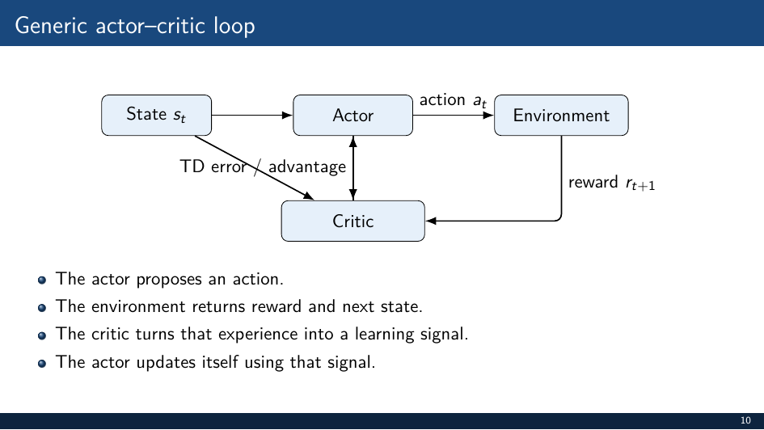
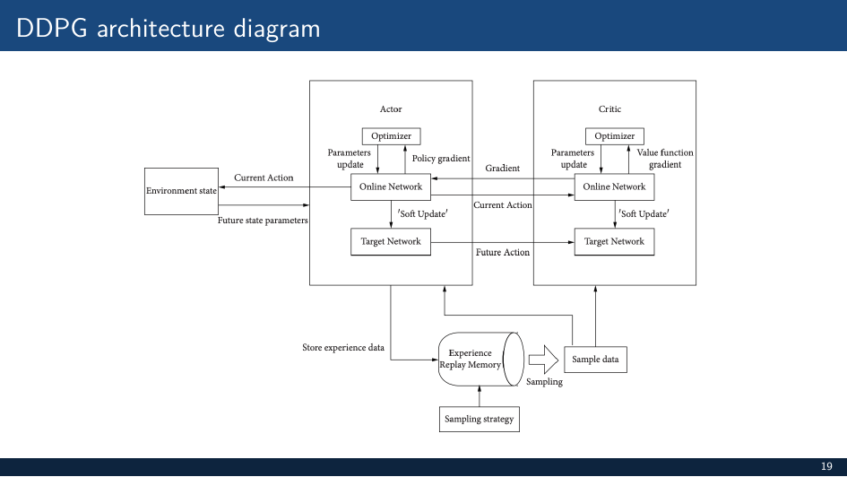
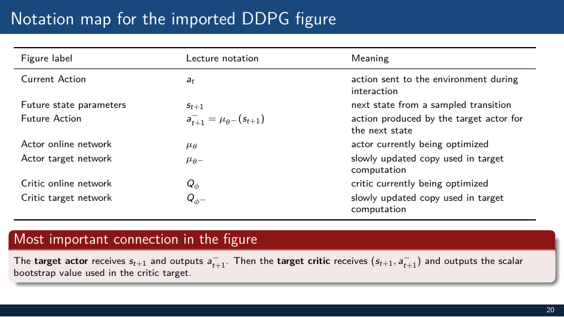
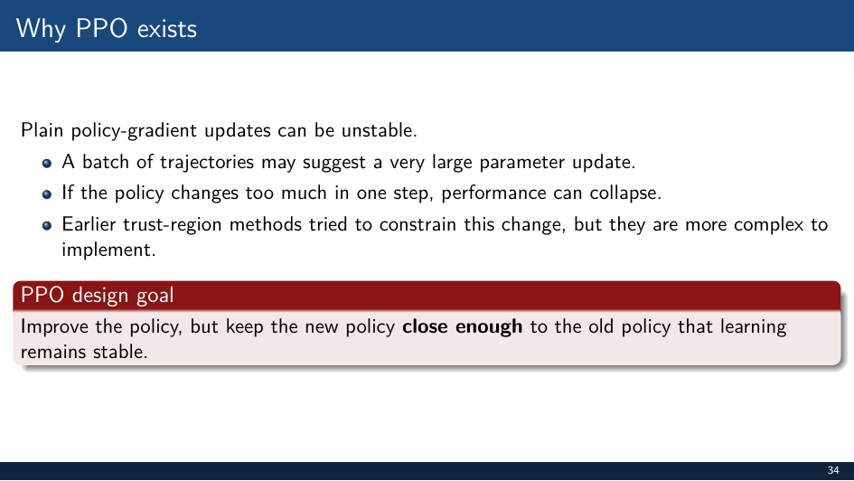

# Deep RL Module 4: DDPG and PPO

## Continuous Control

Policy gradient methods extend naturally to continuous actions: πθ(a|s) outputs a distribution over ℝⁿ (e.g., Gaussian).

Challenges:
- argmax over Q is intractable for continuous actions
- Critic must handle continuous (s,a) pairs

## Actor-Critic Framework (Review)


- **Actor** πθ(a|s): selects actions
- **Critic** Vφ(s) or Qφ(s,a): evaluates actions / states
- Actor is updated using critic's signal; critic is updated via TD error

---

## DDPG (Deep Deterministic Policy Gradient)




### Key Idea
Extend DQN to continuous action spaces using a **deterministic** actor μθ(s) ∈ ℝⁿ.

Because the actor is deterministic, we can differentiate through it:
```
∇θ J ≈ E [ ∇θ μθ(s) · ∇a Qφ(s,a)|_{a=μθ(s)} ]
```
(Deterministic Policy Gradient theorem — Silver et al. 2014)

### Networks
| Network | Parameters | Purpose |
|---------|-----------|---------|
| Online actor | θ | Selects actions μθ(s) |
| Target actor | θ⁻ | Provides stable action for critic target |
| Online critic | φ | Estimates Q(s,a) |
| Target critic | φ⁻ | Computes TD target |

### Soft Target Updates (Polyak averaging)
Instead of hard copy every C steps:
```
θ⁻ ← τ θ + (1−τ) θ⁻        τ ≪ 1 (e.g., 0.005)
```
Slow, smooth target tracking → more stable than hard updates.

### Critic Target
```
yₜ = rₜ + γ Qφ⁻(sₜ₊₁, μθ⁻(sₜ₊₁))    (0 if terminal)
```
Uses target actor to compute next action → prevents coupling.

### Actor Update
```
∇θ J ≈ (1/N) Σ ∇a Qφ(s,a)|_{a=μθ(s)} · ∇θ μθ(s)
```
Gradient ascent on Q through the actor.

### Exploration
- Deterministic policy → no intrinsic exploration
- Add noise to actions during training: **Ornstein-Uhlenbeck (OU) noise** or Gaussian noise
  ```
  aₜ = μθ(sₜ) + Nₜ
  ```
- OU noise is temporally correlated (smooth exploration for physical systems)

### Replay Buffer
Off-policy: transitions (s,a,r,s',done) stored and replayed.

### DDPG Training Loop
```
for each step:
    aₜ = μθ(sₜ) + noise
    execute aₜ, store transition
    sample mini-batch from buffer
    compute critic target yₜ
    update critic: minimize (yₜ - Qφ(sₜ,aₜ))²
    update actor: gradient ascent on Qφ(s, μθ(s))
    soft update target networks
```

---

## PPO (Proximal Policy Optimization)



### Motivation
REINFORCE and basic actor-critic suffer from large policy updates that can destroy performance. PPO constrains the update size.

### Stochastic Policy
Unlike DDPG, PPO outputs a distribution: πθ(a|s) ~ N(μθ(s), σ²) for continuous actions.

On-policy: samples collected under current policy, used once, then discarded.

### Clipped Objective
Define probability ratio:
```
rₜ(θ) = πθ(aₜ|sₜ) / πθ_old(aₜ|sₜ)
```
PPO objective:
```
L^CLIP(θ) = E [ min( rₜ(θ) Âₜ,  clip(rₜ(θ), 1-ε, 1+ε) Âₜ ) ]
```
- If Âₜ > 0: increase prob of aₜ, but no more than 1+ε times old prob
- If Âₜ < 0: decrease prob of aₜ, but no less than 1-ε times old prob
- Typical ε = 0.2

### Full PPO Loss
```
L(θ) = L^CLIP(θ) − c₁ L^VF(θ) + c₂ H[πθ]
```
- **Value loss** L^VF: (V(s) − Vₜarget)² — trains the critic
- **Entropy bonus** H: encourages exploration by preventing policy collapse
- c₁ ≈ 0.5, c₂ ≈ 0.01

### GAE (Generalized Advantage Estimation)
```
Âₜ = Σₗ (γλ)ˡ δₜ₊ₗ      δₜ = rₜ + γ V(sₜ₊₁) − V(sₜ)
```
- λ=0: pure TD(0) estimate — low variance, high bias
- λ=1: full MC return — high variance, low bias
- Typical λ = 0.95

### Rollout Buffer (On-Policy)
- Collect N steps of experience with current policy
- Compute advantages via GAE
- Update policy for K epochs on collected data
- Discard buffer; repeat

### PPO Training Loop
```
for each rollout:
    collect N transitions with πθ_old
    compute GAE advantages
    for K epochs:
        sample mini-batches from rollout
        compute clipped loss
        update θ
    θ_old ← θ
```

---

## DDPG vs PPO Comparison

| | DDPG | PPO |
|--|------|-----|
| Policy type | Deterministic | Stochastic |
| On/Off policy | Off-policy | On-policy |
| Action space | Continuous | Discrete or continuous |
| Exploration | Explicit noise | Entropy bonus + stochasticity |
| Sample efficiency | Higher | Lower |
| Stability | Moderate | High |
| Hyperparameter sensitivity | High | Lower |

## Key Takeaways
- DDPG = DQN extended to continuous actions with deterministic actor; soft target updates stabilize training
- PPO clips the policy update ratio to prevent destructive updates
- GAE trades off bias/variance in advantage estimation via λ
- PPO is the go-to algorithm for stability; DDPG for sample efficiency in continuous control
