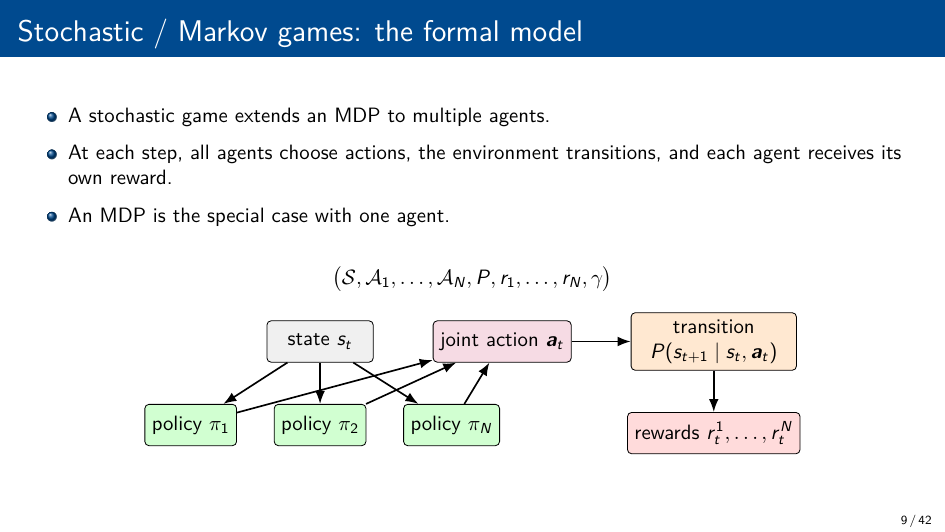
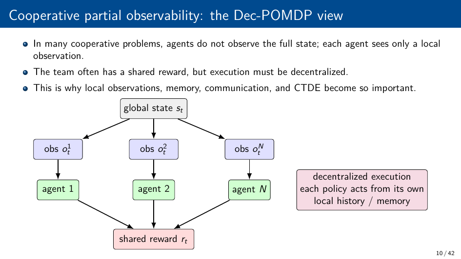
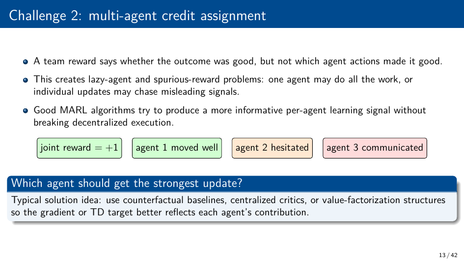
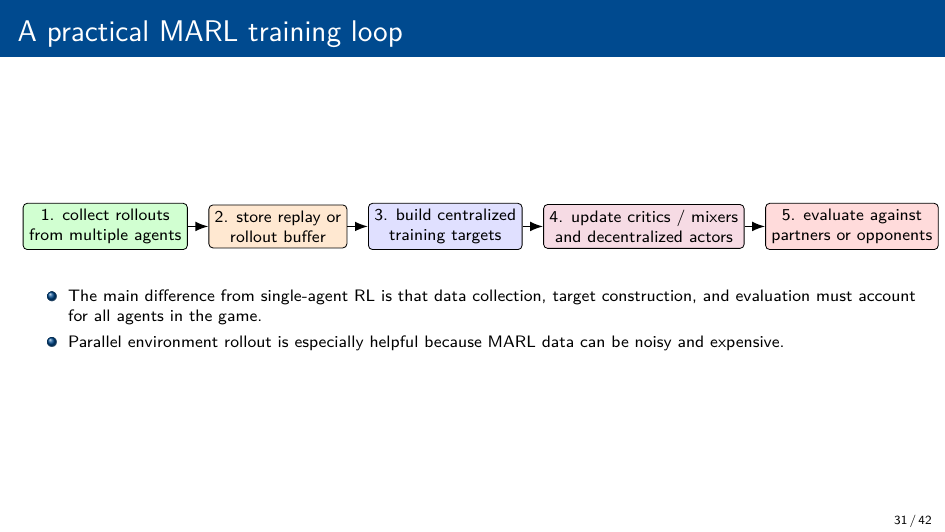
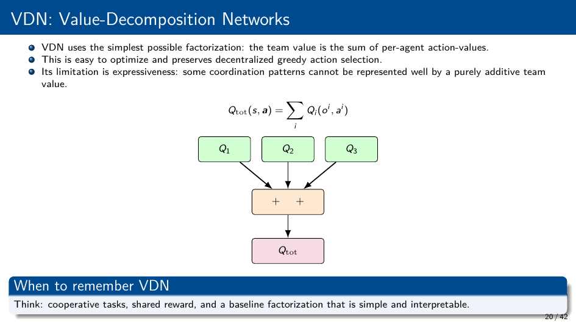
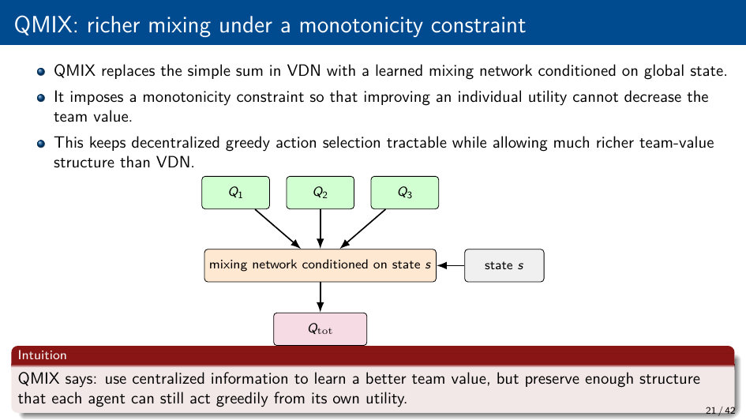
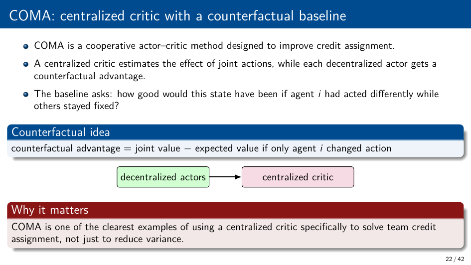
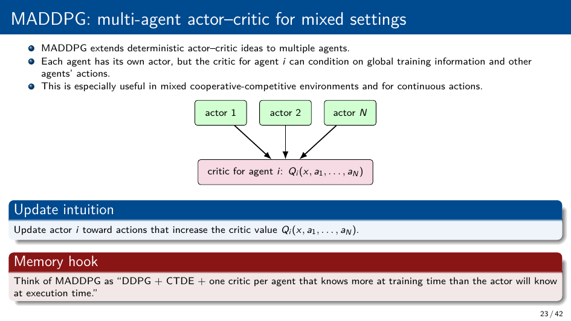
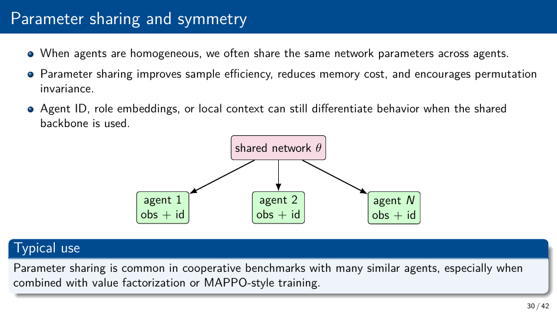
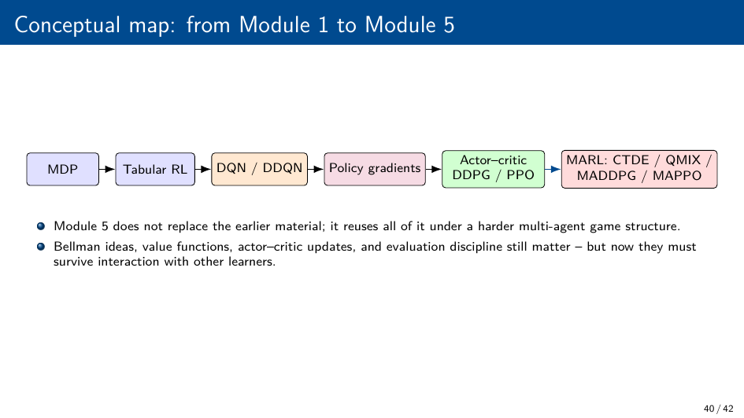

# Deep RL Module 5: Multi-Agent Reinforcement Learning (MARL)

## Markov / Stochastic Games


Extension of MDP to N agents: (S, A₁,...,Aₙ, P, R₁,...,Rₙ, γ)
- Each agent i has its own action space Aᵢ and reward function Rᵢ
- Joint action: **a** = (a₁,...,aₙ)
- Transition: s' ~ P(·|s, **a**)
- Agents observe (possibly partial) state; act simultaneously

## Settings by Reward Structure


| Setting | Rewards | Goal | Example |
|---------|---------|------|---------|
| **Cooperative** | Shared team reward | Maximize joint return | Multi-robot coordination |
| **Competitive** | Zero-sum | Own reward, hurt others | Chess, RTS games |
| **Mixed** | Individual (partly aligned) | Individual returns | Autonomous driving |

## Core Challenges in MARL

### 1. Non-Stationarity
- From agent i's perspective, other agents are part of the environment
- As other agents learn, the environment's transition dynamics change
- Breaks convergence guarantees of single-agent RL algorithms

### 2. Credit Assignment
- With a shared team reward, which agent's actions caused the reward?
- Hard to attribute individual contributions in large teams

### 3. Partial Observability
- Agents typically observe only local information oᵢ (not full state s)
- Formally: Decentralized Partially Observable Markov Decision Process (Dec-POMDP)

### 4. Joint Action Space Explosion
- Joint action space: |A₁| × |A₂| × ... × |Aₙ| — exponential in N
- Makes centralized Q(s, **a**) intractable for large N

## CTDE (Centralized Training with Decentralized Execution)




The dominant paradigm in cooperative MARL:
- **Training**: access to global state, all agents' observations and actions
- **Execution**: each agent acts using only its own local observation oᵢ
- Allows rich centralized credit assignment during training; scalable at test time

## Approaches

### Independent Learners (IL)
- Each agent runs its own RL algorithm (e.g., DQN) independently
- Treats other agents as part of the environment
- Simple, scales easily
- Fails due to non-stationarity; no convergence guarantees

### Value Factorization (Cooperative, CTDE)




#### VDN (Value Decomposition Networks)
```
Q_tot(s, a) = Σᵢ Qᵢ(oᵢ, aᵢ)
```
- Global Q is sum of individual Qs
- Each agent acts greedily on its own Qᵢ
- Strong assumption: additivity

#### QMIX
```
Q_tot = f_mix(Q₁(o₁,a₁), ..., Qₙ(oₙ,aₙ); s)
```
- Mixing network combines individual Qs with weights conditioned on global state s
- **IGM condition**: monotonicity constraint — argmax of Q_tot equals individual argmaxes
  ```
  ∂Q_tot / ∂Qᵢ ≥ 0   for all i
  ```
- More expressive than VDN; still allows decentralized execution
- Training: minimize TD loss on Q_tot with global reward

### Centralized Critic Methods




#### COMA (Counterfactual Multi-Agent)
- Centralized critic estimates Q(s, **a**)
- **Counterfactual baseline**: advantage for agent i
  ```
  Aᵢ(s, **a**) = Q(s, **a**) − Σ_{a'ᵢ} πᵢ(a'ᵢ|oᵢ) Q(s, a₋ᵢ, a'ᵢ)
  ```
- Isolates agent i's contribution by marginalizing over its own actions

#### MADDPG (Multi-Agent DDPG)
- Extends DDPG to multi-agent
- Centralized critic Qᵢ(s, a₁,...,aₙ) for each agent i
- Decentralized actor μᵢ(oᵢ)
- Off-policy with replay buffer
- Works for cooperative and competitive settings

#### MAPPO (Multi-Agent PPO)
- PPO with shared centralized critic that takes global state
- Each agent has own actor (or shared with parameter sharing)
- Strong baseline; surprisingly effective in cooperative tasks

## Additional Techniques

### Self-Play
- Competitive settings: train agent against copies of itself
- Policy improves as it faces increasingly capable opponents
- Risk: cyclic strategies (rock-paper-scissors dynamics)

### Communication
- Agents exchange messages as additional actions or observations
- Differentiable communication: DIAL, CommNet — learn what to communicate
- Effective when bandwidth is unlimited; harder under communication constraints

### Parameter Sharing


- All agents share the same policy network parameters
- Agent identity encoded as input (one-hot or embedding)
- Reduces sample complexity; agents learn from each other's experience
- Only valid when agents are homogeneous

## Evaluation
- Cooperative: team return, win rate
- Competitive: Elo / win rate vs fixed opponents or self-play
- Mixed: individual returns + social welfare metrics
- Always average over multiple seeds and opponent configurations

## MARL Algorithm Summary

| Algorithm | Setting | Approach | Key Property |
|-----------|---------|----------|--------------|
| IQL | Coop/Comp | Off-policy, independent | Simple, non-stationary |
| VDN | Cooperative | Value factorization | Additive Q decomposition |
| QMIX | Cooperative | Value factorization | Monotonic mixing, IGM |
| COMA | Cooperative | Centralized critic | Counterfactual advantage |
| MADDPG | Mixed | Centralized critic + DDPG | Continuous actions |
| MAPPO | Cooperative | Centralized critic + PPO | Strong cooperative baseline |

## Key Takeaways


- MARL extends RL to multiple agents; non-stationarity is the fundamental challenge
- CTDE is the dominant paradigm: train centrally, execute locally
- VDN/QMIX factorize the joint Q; COMA/MADDPG/MAPPO use centralized critics
- IGM in QMIX ensures individual greedy actions equal joint greedy action
- Parameter sharing + MAPPO is a strong, simple baseline for cooperative tasks
