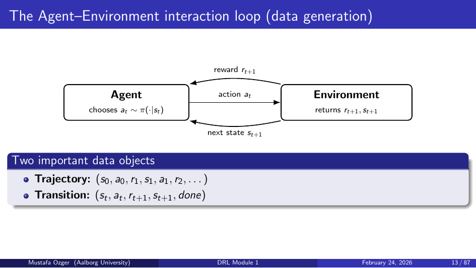
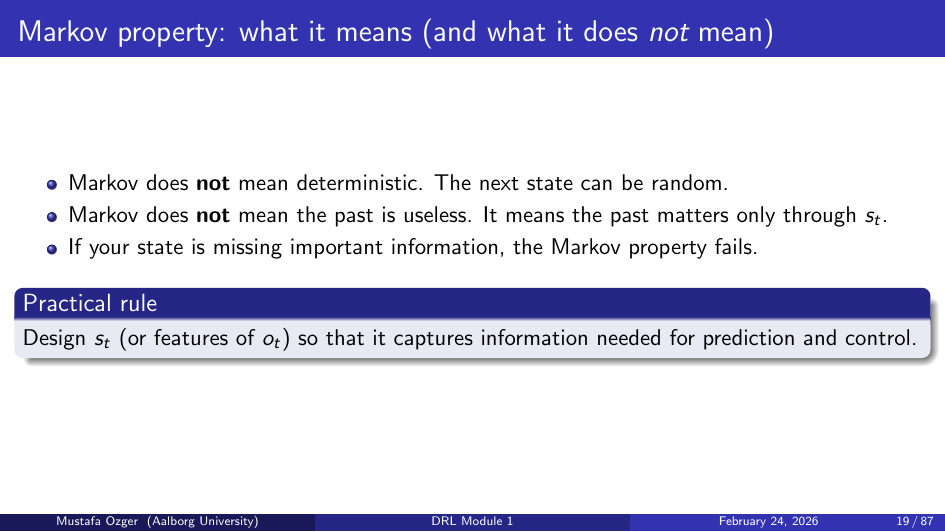
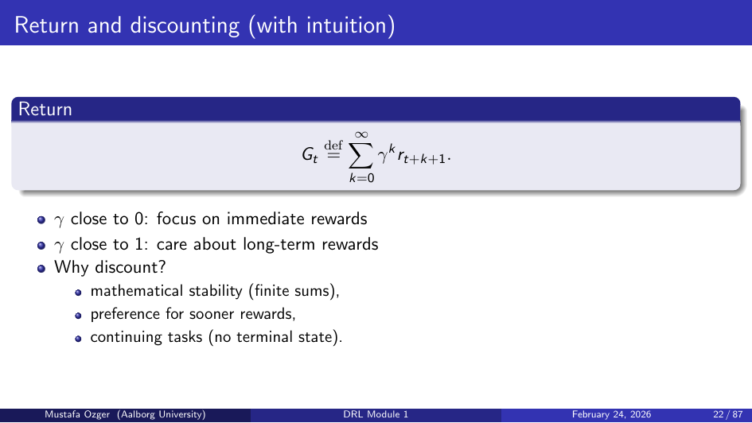
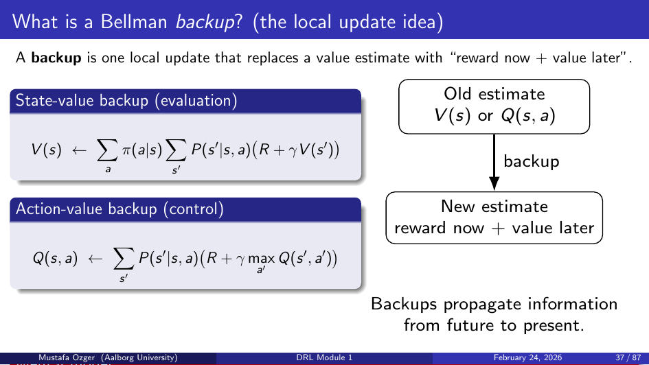
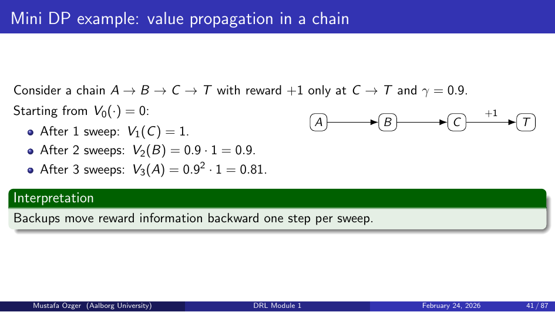
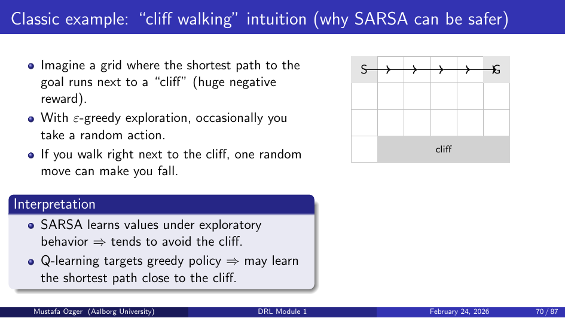

# Deep RL Module 1: Foundations of Reinforcement Learning

## RL vs Supervised Learning
- **Supervised**: fixed labeled dataset, ground-truth targets provided
- **RL**: agent generates its own data by acting; reward signal is delayed and sparse; no teacher

## Agent–Environment Loop


At each step t:
1. Agent observes state sₜ
2. Agent selects action aₜ ~ π(·|sₜ)
3. Environment transitions to sₜ₊₁ ~ P(·|sₜ, aₜ)
4. Agent receives reward rₜ = R(sₜ, aₜ)

## Markov Decision Process (MDP)


Formal framework: (S, A, P, R, γ)
- **S**: state space
- **A**: action space
- **P(s'|s,a)**: transition probability
- **R(s,a)**: expected reward
- **γ ∈ [0,1)**: discount factor

**Markov Property**: sₜ₊₁ ⊥ history | sₜ — the current state is sufficient for future predictions.

## Returns and Discounting


- **Undiscounted return**: Gₜ = rₜ + rₜ₊₁ + rₜ₊₂ + ...
- **Discounted return**: Gₜ = rₜ + γ rₜ₊₁ + γ² rₜ₊₂ + ... = Σₖ γᵏ rₜ₊ₖ
- Discounting ensures finite returns; γ close to 1 = far-sighted, close to 0 = myopic

## Policies
- **Deterministic**: a = μ(s)
- **Stochastic**: a ~ π(·|s)
- Goal: find policy π* that maximizes E[Gₜ]

## Value Functions
- **State-value**: Vπ(s) = Eπ[Gₜ | sₜ=s]
- **Action-value**: Qπ(s,a) = Eπ[Gₜ | sₜ=s, aₜ=a]
- Relationship: Vπ(s) = Σₐ π(a|s) Qπ(s,a)

## Bellman Equations



### Bellman Expectation
```
Vπ(s) = Σₐ π(a|s) Σₛ' P(s'|s,a) [R(s,a) + γ Vπ(s')]
Qπ(s,a) = Σₛ' P(s'|s,a) [R(s,a) + γ Σₐ' π(a'|s') Qπ(s',a')]
```

### Bellman Optimality
```
V*(s) = max_a Σₛ' P(s'|s,a) [R(s,a) + γ V*(s')]
Q*(s,a) = Σₛ' P(s'|s,a) [R(s,a) + γ max_a' Q*(s',a')]
```
Optimal policy: π*(s) = argmax_a Q*(s,a)

## Dynamic Programming (requires full model)



### Policy Evaluation
Iteratively apply Bellman expectation to estimate Vπ.

### Policy Improvement
Greedy update: π'(s) = argmax_a Q(s,a).

### Policy Iteration
Alternate policy evaluation and improvement until convergence.

### Value Iteration
Directly apply Bellman optimality update:
```
V(s) ← max_a [R(s,a) + γ Σₛ' P(s'|s,a) V(s')]
```

## Monte Carlo (MC) Methods
- Sample full episodes, compute returns Gₜ
- Update: V(sₜ) ← V(sₜ) + α(Gₜ − V(sₜ))
- No model needed; high variance; requires episodic tasks

## Temporal Difference (TD) Learning

### TD(0)
- One-step bootstrap: Gₜ ≈ rₜ + γ V(sₜ₊₁)
- Update: V(sₜ) ← V(sₜ) + α(rₜ + γV(sₜ₊₁) − V(sₜ))
- Lower variance than MC; biased (bootstrap)

### n-Step Returns
- Bridge between TD(0) (n=1) and MC (n=∞)
- Gₜ⁽ⁿ⁾ = rₜ + γ rₜ₊₁ + ... + γⁿ⁻¹ rₜ₊ₙ₋₁ + γⁿ V(sₜ₊ₙ)

## Exploration
- **ε-greedy**: with prob ε take random action, else greedy
- **GLIE** (Greedy in the Limit with Infinite Exploration): ε→0 as t→∞; needed for convergence guarantees

## On-Policy vs Off-Policy
| | On-Policy | Off-Policy |
|--|-----------|------------|
| Definition | Learn about behavior policy | Learn about target policy different from behavior |
| Example | SARSA | Q-learning |
| Data efficiency | Lower | Higher (replay buffer) |

## SARSA (On-Policy TD Control)


Update using (sₜ, aₜ, rₜ, sₜ₊₁, aₜ₊₁):
```
Q(sₜ,aₜ) ← Q(sₜ,aₜ) + α[rₜ + γQ(sₜ₊₁,aₜ₊₁) − Q(sₜ,aₜ)]
```

## Q-Learning (Off-Policy TD Control)
Update using max over next actions:
```
Q(sₜ,aₜ) ← Q(sₜ,aₜ) + α[rₜ + γ max_a Q(sₜ₊₁,a) − Q(sₜ,aₜ)]
```

## Function Approximation
When state space is large/continuous, use parameterized Qθ(s,a).
- Tabular methods don't scale → use neural networks
- **Deadly triad**: function approximation + bootstrapping + off-policy → potential instability

## Key Takeaways
- MDP is the formal framework; Bellman equations define optimal values
- DP: exact but requires model; MC: model-free but high variance; TD: model-free, low variance
- SARSA converges to optimal policy under GLIE; Q-learning converges independently of behavior
- Function approximation enables scaling but introduces instability risks
